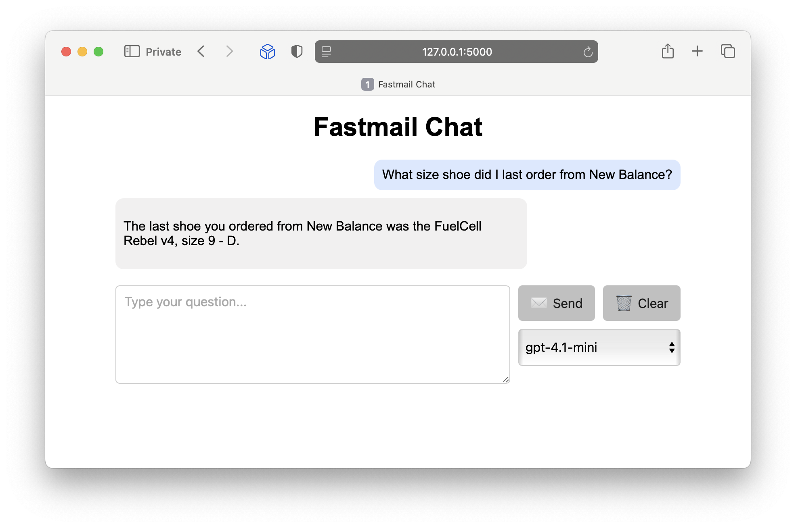

# Fastmail Chat



A web-based chat interface that let's you ask OpenAI models about your Fastmail messages. Requires a [Fastmail MCP server](https://github.com/jeffjjohnston/fastmail-mcp-server).

## Setup

Install the app and dependencies:

```bash
git clone https://github.com/jeffjjohnston/fastmail-chat.git
cd fastmail-chat
python3.12 -m venv .venv
source .venv/bin/activate
pip install -r requirements.txt
```

Set the following environment variables:

- `OPENAI_API_KEY` – your OpenAI API key
- `BEARER_TOKEN` – bearer token for the MCP server
- `FASTMAIL_API_KEY` – Fastmail API key
- `MCP_SERVER_URL` – URL of the Fastmail MCP server
- `SECRET_KEY` – Flask session secret

To obtain a Fastmail API key, login to your Fastmail account and navigate to Settings -> Privacy & Security -> **Connected apps & API tokens**.

Run the server with:

```bash
python app.py
```

The web app is available at <http://127.0.0.1:5000>.
